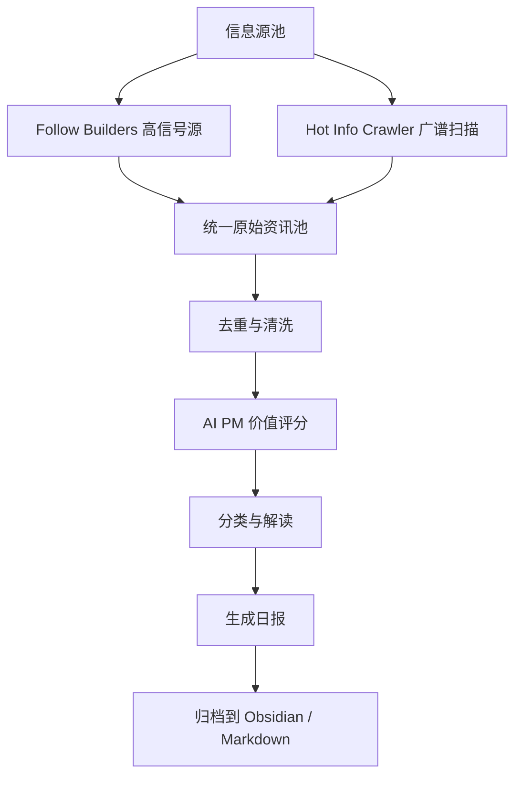

# AI PM Daily Brief

**English** | **中文**

# AI 产品经理每日简报

一个面向 AI 产品经理的信息收集与解读 Skill，整合高信号 AI builders、官方博客、播客、论文、社区讨论和中文热点，把每天分散的信息整理成可行动的产品情报。

**理念：** 不追热点本身，而是追踪会影响产品判断的信号：产品发布、竞品动作、模型能力变化、Agent / Workflow 趋势、用户反馈、商业化和增长线索。

## 你会得到什么

每天或按需生成一份 AI PM Daily Brief，包含：

- 今日最值得关注的 AI 产品与行业变化
- AI 产品发布、竞品动态和平台策略信号
- 模型能力、Agent、Workflow、开发者工具等趋势
- 来自社区、Reddit、即刻等渠道的用户反馈和需求线索
- 播客、长文、论文中的深度洞察
- 面向 AI 产品经理的「为什么重要」和「可跟进问题」
- 可保存到 Obsidian / Markdown 知识库的结构化日报

## 信息源设计

这个 Skill 把信息源分成两层：

1. **高信号精选层**：用 Follow Builders 追踪真正的一手 builder、AI 播客和官方博客。
2. **广谱热点扫描层**：用 Hot Info Crawler 或类似工具扫描论文、X、YouTube、Reddit、即刻等更宽的信息面。

最终不会简单按热度排序，而是会合并去重后，按 AI 产品经理价值重新筛选。

## Follow Builders 信息源

Follow Builders 作为精选的一手信号源，用来补充 AI builder、研究者、创业者、产品负责人、工程师和 AI 公司官方内容。它不是泛新闻源，而是更偏高质量观点、产品判断和长期趋势。

### X 上的 AI Builders（26 位）

默认追踪：

[Andrej Karpathy](https://x.com/karpathy), [Swyx](https://x.com/swyx), [Josh Woodward](https://x.com/joshwoodward), [Boris Cherny](https://x.com/bcherny), [Thibault Sottiaux](https://x.com/thsottiaux), [Peter Yang](https://x.com/petergyang), [Nan Yu](https://x.com/thenanyu), [Madhu Guru](https://x.com/realmadhuguru), [Amanda Askell](https://x.com/AmandaAskell), [Cat Wu](https://x.com/_catwu), [Thariq](https://x.com/trq212), [Google Labs](https://x.com/GoogleLabs), [Amjad Masad](https://x.com/amasad), [Guillermo Rauch](https://x.com/rauchg), [Alex Albert](https://x.com/alexalbert__), [Aaron Levie](https://x.com/levie), [Ryo Lu](https://x.com/ryolu_), [Garry Tan](https://x.com/garrytan), [Matt Turck](https://x.com/mattturck), [Zara Zhang](https://x.com/zarazhangrui), [Nikunj Kothari](https://x.com/nikunj), [Peter Steinberger](https://x.com/steipete), [Dan Shipper](https://x.com/danshipper), [Aditya Agarwal](https://x.com/adityaag), [Sam Altman](https://x.com/sama), [Claude](https://x.com/claudeai)

这些内容主要用于发现：

- AI 产品和功能发布
- builder 对行业方向的判断
- Agent、Workflow、Developer Tools 等产品趋势
- 竞品和平台战略信号
- AI 产品经理可借鉴的产品、组织和商业化洞察

### AI 播客（6 个）

默认追踪：

- [Latent Space](https://www.youtube.com/@LatentSpacePod)
- [Training Data](https://www.youtube.com/playlist?list=PLOhHNjZItNnMm5tdW61JpnyxeYH5NDDx8)
- [No Priors](https://www.youtube.com/@NoPriorsPodcast)
- [Unsupervised Learning](https://www.youtube.com/@RedpointAI)
- [The MAD Podcast with Matt Turck](https://www.youtube.com/@DataDrivenNYC/videos)
- [AI & I by Every](https://www.youtube.com/playlist?list=PLuMcoKK9mKgHtW_o9h5sGO2vXrffKHwJL)

播客内容适合进入「深度内容」或「今日产品经理 Takeaways」，重点提炼：

- 嘉宾对 AI 市场和产品趋势的判断
- 公司如何落地 AI、Agent、Workflow 和数据基础设施
- 对 AI 产品商业化、定价、增长、企业采用的启发
- 值得产品经理进一步研究的问题

### 官方 AI 博客（2 个）

默认追踪：

- [Anthropic Engineering](https://www.anthropic.com/engineering) — Anthropic 团队的技术深度文章
- [Claude Blog](https://claude.com/blog) — Claude 的产品公告与更新

这类内容优先作为高可信来源，用于识别：

- 模型能力变化
- 产品发布和 changelog
- 工程实践和基础设施演进
- Trust、Safety、Evals、Enterprise Adoption 等官方信号

## Hot Info Crawler 信息源

Hot Info Crawler 作为广谱热点扫描层，用于发现更宽的信息面：

- **HuggingFace Papers**：AI/ML 论文和模型趋势
- **X.com**：实时热点和大 V 观点
- **YouTube**：深度视频内容
- **Reddit**：社区讨论、用户反馈和真实使用经验
- **即刻**：中文社区热点

Follow Builders 更像「高质量精选源」，Hot Info Crawler 更像「广撒网雷达」。最终日报会把两者合并去重，再按 AI 产品经理价值重新排序。

## 快速开始

1. 将本仓库安装到 Codex skills 目录：

```bash
git clone https://github.com/gd08131929350818-gif/ai-pm-daily-brief.git ~/.codex/skills/ai-pm-daily-brief
```

2. 在 Codex / ChatGPT 中调用：

```text
Use $ai-pm-daily-brief to generate today's AI PM daily brief and save it to Obsidian.
```

3. Agent 会按照 Skill 中的 SOP 执行：收集信息、去重、按 AI 产品经理价值评分、分类、生成日报并归档。

## 修改设置

你可以通过自然语言修改偏好，直接告诉你的 agent：

- “改成每天 1PM 北京时间生成”
- “保存到我的 Obsidian 每日资讯文件夹”
- “更关注 Agent 和 Workflow”
- “减少泛新闻，多关注竞品和产品发布”
- “把摘要写得更短一点”
- “显示我当前的日报设置”

## 自定义摘要风格

Skill 使用参考文件控制日报的评分标准、分类方式和输出结构：

- `references/source-model.md` — 信息源模型和采集架构
- `references/digest-template.md` — PM 价值评分、分类和 Markdown 输出模板

你可以要求 agent 根据你的偏好调整这些文件，例如：

- 更偏产品策略
- 更偏竞品分析
- 更偏商业化和 pricing
- 更偏用户反馈和社区洞察
- 更偏中国市场

## 输出结构

默认日报包含：

- 今日必看
- 产品发布与竞品动态
- 模型与技术趋势
- Agent / Workflow
- 用户反馈与社区洞察
- 商业化与增长
- 深度内容：播客 / 视频 / 长文 / 论文
- 今日产品经理 Takeaways

## 工作原理



核心流程：

1. 从 Follow Builders、Hot Info Crawler 或用户提供的来源中收集原始内容
2. 将不同来源统一成标准 item 格式
3. 按 URL、Tweet ID、YouTube video ID、Podcast GUID、文章 slug 等去重
4. 用 AI 产品经理视角进行价值评分
5. 按主题分类并生成中文日报
6. 输出到聊天窗口或归档到 Obsidian / Markdown

## Skill 结构

```text
ai-pm-daily-brief/
├── SKILL.md
├── agents/
│   └── openai.yaml
└── references/
    ├── source-model.md
    └── digest-template.md
```

## 系统要求

- 一个支持 Codex Skills 的 AI agent
- 网络连接，用于读取信息源或中央 feed
- 可选：Obsidian / Markdown 知识库作为归档位置

## 隐私

- Skill 本身不需要保存任何平台 API key
- 如果使用 Follow Builders 中央 feed，内容由公开 feed 提供
- 如果接入 Hot Info Crawler，采集范围取决于你的本地配置
- 你的偏好、归档路径和生成结果保留在你自己的设备或仓库中

## 许可证

MIT
