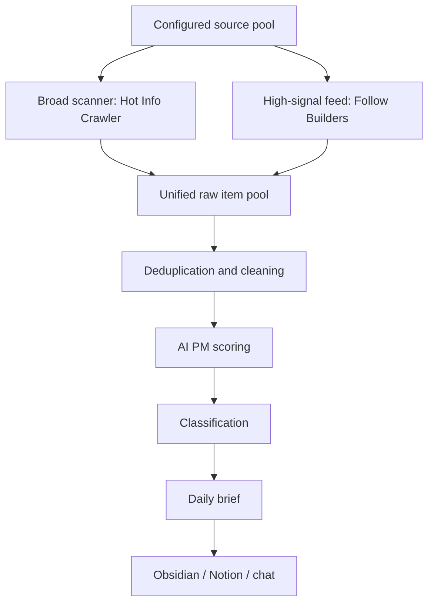

# Source Model

Use this reference when setting up, changing, or explaining the collection layer for the AI PM daily brief.

## Traditional Manual Collection

Traditional AI news collection usually looks like this:

1. Open X, blogs, newsletters, Product Hunt, HN, Reddit, YouTube, podcasts, GitHub, and Chinese communities manually.
2. Skim headlines and social metrics.
3. Open promising links.
4. Copy links and notes into a knowledge base.
5. Manually classify by topic.
6. Write a daily summary.

Weaknesses: time-consuming, inconsistent, hard to deduplicate, easy to miss primary sources, and too dependent on the collector's energy that day.

## AI-Upgraded Collection

The upgraded workflow separates broad scanning from high-signal feeds:

## Source Pools

### High-Signal Builder Layer

Use Follow Builders as the curated AI builder layer:

- `feed-x.json`: recent posts from selected AI builders.
- `feed-podcasts.json`: AI podcast episodes and transcripts.
- `feed-blogs.json`: official AI blogs and engineering posts.

Strength: high signal, curated sources, central feed, deduped upstream, no local API keys.

Best for:

- AI founder/researcher/operator opinions
- Product/strategy signals from builders
- Long-form podcast insights
- Official AI company updates

### Broad Scanning Layer

Use Hot Info Crawler or an equivalent collector for broader discovery:

- HuggingFace Papers: AI/ML papers and model trends
- X.com: real-time opinions and launches
- YouTube: long-form product/technical content
- Reddit: user pain, workflows, community feedback
- Jike: Chinese community trends
- GitHub: repos, releases, issues, stars
- Product Hunt / HN: launch and builder community reactions

Strength: broad coverage and serendipity.

Risk: noisy. Always re-rank by AI PM value.

## Suggested Topic Taxonomy

Use these topic groups as a starting point:

- AI tools and product launches
- LLM/model capability changes
- Agent and workflow automation
- AI product UX and interaction design
- Enterprise AI adoption
- Developer tools and infrastructure
- Consumer AI products
- Pricing, packaging, and monetization
- GTM, growth, and distribution
- User feedback and community pain points
- AI safety, trust, evals, and compliance

## Deduplication Keys

Use the strongest available key:

- X/Twitter: status ID
- YouTube: video ID
- Podcast: GUID
- Blog/news: canonical URL or slug
- Paper: arXiv ID, HuggingFace paper ID, DOI, or URL
- GitHub: repo + release/tag/issue/PR ID
- Reddit/Jike/HN/Product Hunt: post ID or canonical URL

If several sources cover the same event, merge them into one item and keep the primary source first.

## Source Reliability

Prioritize:

1. Official product/company announcements
2. Direct posts from builders, founders, PMs, researchers, or engineers
3. Primary docs, changelogs, release notes, papers, repos
4. Community posts with concrete user evidence
5. Commentary and influencer summaries

Use commentary only as context unless it contains original analysis or strong user-signal evidence.
